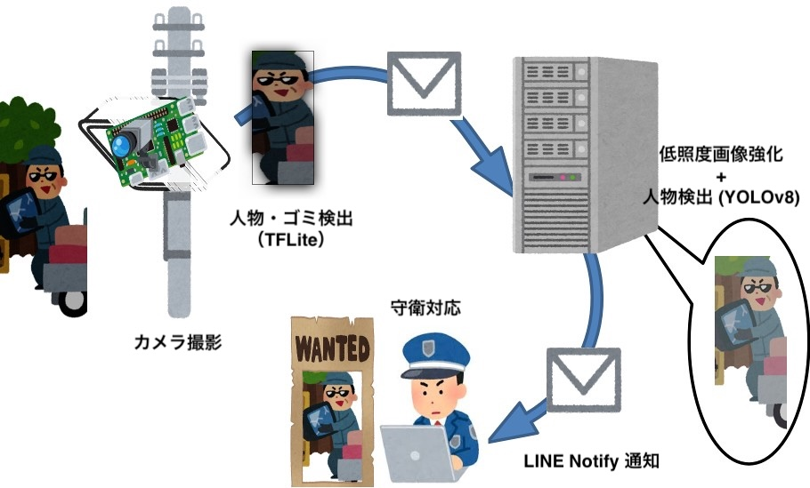
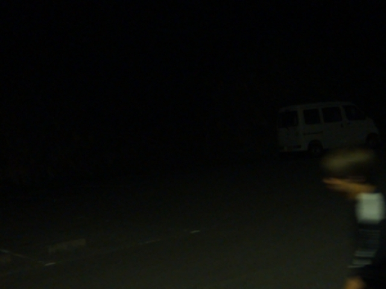
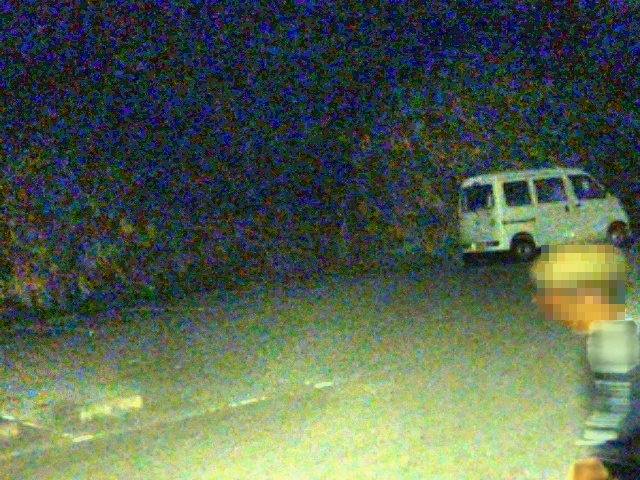

# ラズベリーパイを使った構内不法投棄に対する簡易監視システムの構築

- **目的**: 夜間の不法投棄を低コストで検知
- **コスト**: 2万円弱
- **特徴**: Raspberry Pi + 赤外線カメラ + AI による自動通知
- **成果**: 夜間でも人物を正確に検知、低コストでプロトタイプ完成

## ℹ️ システムの概要
大学キャンパス内の不法投棄を検知するため、低コストで導入可能な監視システムを構築しました。
Raspberry Pi と赤外線カメラを用いて人物を検知し、夜間を含めた不法投棄の早期把握を目指しました。  

学内では異動の時期になると深夜・早朝に不法投棄が発生し、撤去に200万円以上の多額の費用がかかる問題があります。
常時人員を配置するのは困難なため、赤外線カメラとAIによる自動検知・通知システムを開発しました。

**＜システム実機＞**

**補足:**
実証実験を2023年3月に行い、夜間でも人を正確に検知できることを確認しました。

## ⚙️ 使用技術
- : 画像処理・通知スクリプト
- : カメラ制御・前処理
- : 軽量物体検出
- : 人物検出

## 🔄 システム機能
1. **カメラで数秒毎に撮影**
2. **TensorFlow Lite による人物・ゴミ検知**
   - 家具や家電などの対象物を検出
3. **連続検知判定**
   - 人物とゴミが数秒間連続して撮影された場合、画像を送信
4. **低照度画像強化（夜間のみ）**
   - 特定フォルダに画像があれば、自動で Python スクリプトを実行
5. **YOLOv8 による人物検出（Linux サーバー上）**
6. **LINE Notify 通知**
   - 人物が検出された場合、守衛に通知

**＜概要図＞**

> **セキュリティ制約への対応**  
> 学内のセキュリティ上、Raspberry Pi から直接サーバーへの画像送信は不可でした。  
> そのため、まず関係者の LINE に通知を送信し、その後 Linux サーバーに画像を転送して低照度強化や人物検出の処理を実施しました。

## 担当
- 制作・実装（学生）: 3名
- 監修・指導（指導教員）: 1名

## 結果
- 夜間でも人物の検知に成功（ノイズは多いが識別可能）
- 昼間は高精度に人物を認識
- 少ないコスト（2万円弱）で基本的な、不法投棄防止システムのプロトタイプを構築

**＜画像比較＞**  
| Before | After |
|--------|-------|
|  |  |

## 成果・工夫
- ヒアリングから設計・実装まで担当
- 夜間でも検知できる低照度画像強化モデルを探索・適用
- プログラミング未経験の後輩にOJTで指導
- 低コスト・短期間でプロトタイプを完成

 **開発期間:** 2022年6月〜2023年3月  
 **キーワード:** 不法投棄対策、AI監視、Raspberry Pi、物体検出、夜間検知  

## 参考
- [Dual Illumination Estimation for Robust Exposure Correction](https://arxiv.org/pdf/1910.13688)  
- [Python implementation of two low-light image enhancement techniques via illumination map estimation](https://github.com/pvnieo/Low-light-Image-Enhancement)  
- [Linux ベースのデバイスで Python を使用するためのクイックスタートガイド](https://www.tensorflow.org/lite/guide/python?hl=ja#install_tensorflow_lite_for_python)
