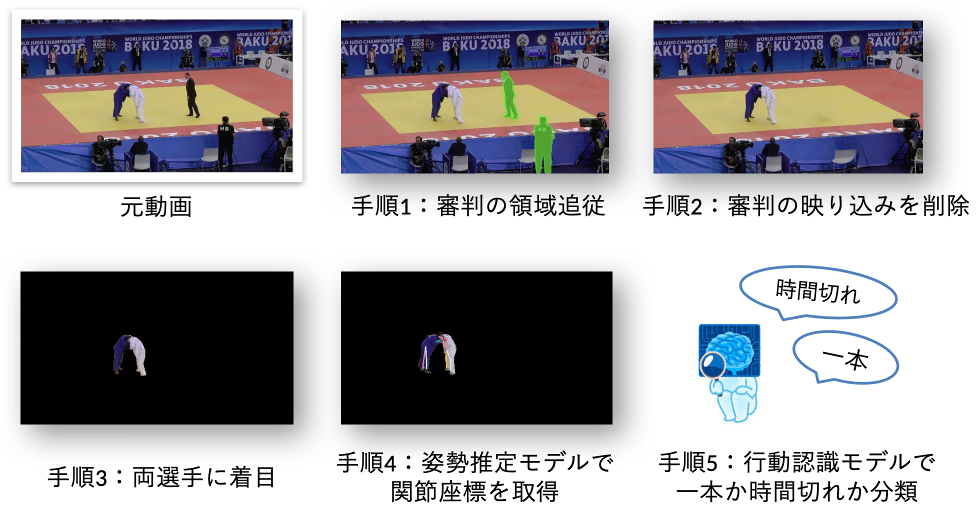

# Judo Ippon Var: 一本/時間切れの行動認識

本研究は、2023年スポーツデータサイエンスコンペティション（柔道部門）にて発表されました。
 （詳細は `docs/スポコン_Judo_2023.pdf` および `docs/SDSC2023[口頭・入賞]柔道.pdf` を参照）

## ○ 概要
本リポジトリは、柔道試合動画の「試合終了直前3秒」から、**「一本」** か **「技あり」** か **「時間切れ」** かを行動認識モデルにて分類する手法を開発した際のPythonコードを、当時の実装に基づいて整理・公開したものです。

主に私はLinuxサーバー上での環境構築や、学習済みモデルの選定・実装・評価を担当しました。
工夫した点としては、本研究では複数のモデルを使用しており、モデルごとに依存関係やライブラリのバージョンが異なっていました。そのため、仮想環境を構築する際には、CUDAや各種ライブラリのバージョン整合性を意識し、できるだけ少ない環境で一連の処理が完結するように構築しました。

また、柔道試合は様々な向きに選手が倒れるため、学習に使う動画を「右・左・前・後」に場合分けし、学習の安定化のため工夫しました。

> **コンペ提供データは、本リポジトリに含めません。**

---

## ○ 背景・目的
- VAR（Video Assistant Referee）の発想を柔道に適用し、**俯瞰視点（映像）で審判を補助**する仕組みを目指しました。  
- シドニー五輪柔道男子 100kg 超級決勝で起きた誤審判定問題もあり、**選手の背中の付き方・速度・強さ**等の定性的基準を定量化する動機があります。
- 手法は **審判の映り込み除去 → 選手のみ抽出 → 姿勢推定（関節位置情報の取得） → 行動認識** の流れです。
  
---

## ○ 分析フロー

| 手順 | 処理内容 | 使用モデル・手法 |
|-----------|-----------|----------------|
| データ準備 | 試合映像の抽出・整形 | OpenCV, MoviePy |
| 1.審判領域追従 | 審判の領域特定・自動セグメント | LangSAM + XMem |
| 2.審判除去 | 審判の映り込み除去 | ProPainter |
| 3.選手着目 | 選手以外の映り込み除去 | LangSAM（2人検出） |
| 4.1.姿勢推定 | 骨格座標の推定 | DeepLabCut（トップダウン型モデル） |
| 4.2.骨格データ化 | 骨格座標（Skeletonベース）作成・可視化・目視評価 | Pyskl（MMAction互換形式） |
| 5.行動認識 | 行動認識モデル学習 | MMAction2 (ST-GCN) |
| 評価 | 行動認識モデルの学習・テスト評価 | Confusion Matrixで性能確認 （2 or 3クラス） |

---

---

## ○ 結果

| 判定分類                      | 正答率        | 備考           |
| ------------------------- | ---------- | ------------ |
| 内股一本 vs 時間切れ（2クラス）        | **93.75%** | 高精度で分類成功     |
| 内股一本 vs 技あり vs 時間切れ（3クラス） | **63.8%**  | 一本・技ありの境界が課題 |

**混同行列**  
| ２クラス | ３クラス |
|--------|-------|
|  |  |

> - 3秒＝**約73フレーム**を入力系列とし、内股一本 vs 時間切れの2クラス、または内股一本/技あり/時間切れの3クラスを分類。
> - 2クラスで **正答率 ≈ 93.75%**（32の動画でテスト）。今後は3クラス精度の改善が課題。  

## ○ 実行環境（参考メモ）

- OS: Google Colab / Linuxサーバー
- Python: 3.9
- 主要ライブラリ
  - OpenMMLab: `mmcv`, `mmengine`, `mmaction2`, `mmpose`, `mmdet`
  - DeepLabCut 2.2+
  - PyTorch >=1.8
  - 画像/動画：`opencv-python`, `ffmpeg`
  - 可視化/解析：`numpy`, `pandas`, `matplotlib`
  - 前処理：`LangSAM`, `XMem`, `ProPainter`

> ※ 本リポジトリは**データ非公開で再現性**はありません。以下は**参考**としての環境メモです。

---

## ○ 今後の改善点
- [ ] **姿勢推定精度の向上**：選手の重なりによる見え隠れを改善する、学習データを増やす
- [ ] **3クラス分類の精度改善**：様々な画角の動画で学習する、学習データ数を増やす

---

## ○ 引用・参考文献
* 陸 煒・盛 拓矢・北島 栄司・宮田 龍太（2023）「行動認識モデルを用いた柔道試合動画からの一本判定」スポーツデータサイエンスコンペティション2023
* Language segment-anythin: [https://github.com/luca-medeiros/lang-segment-anything](https://github.com/luca-medeiros/lang-segment-anything)
* XMem: [https://github.com/hkchengrex/XMem](https://github.com/hkchengrex/XMem)
* ProPainter: [https://github.com/sczhou/ProPainter](https://github.com/sczhou/ProPainter)
* DeepLabCut: [https://github.com/DeepLabCut/maDLC_NatureMethods2022](https://github.com/DeepLabCut/maDLC_NatureMethods2022)
* MMAction2: [https://github.com/open-mmlab/mmaction2](https://github.com/open-mmlab/mmaction2) 

> ※ 研究背景・手法・結果の詳細は `00_docs/スポコン_Judo_2023.pdf` および `SDSC2023[口頭・入賞]柔道.pdf` を参照してください。  
