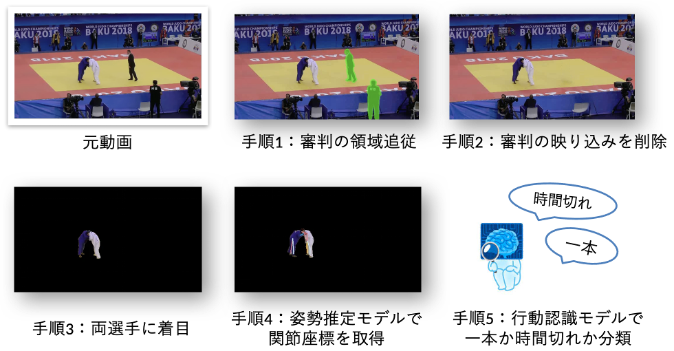
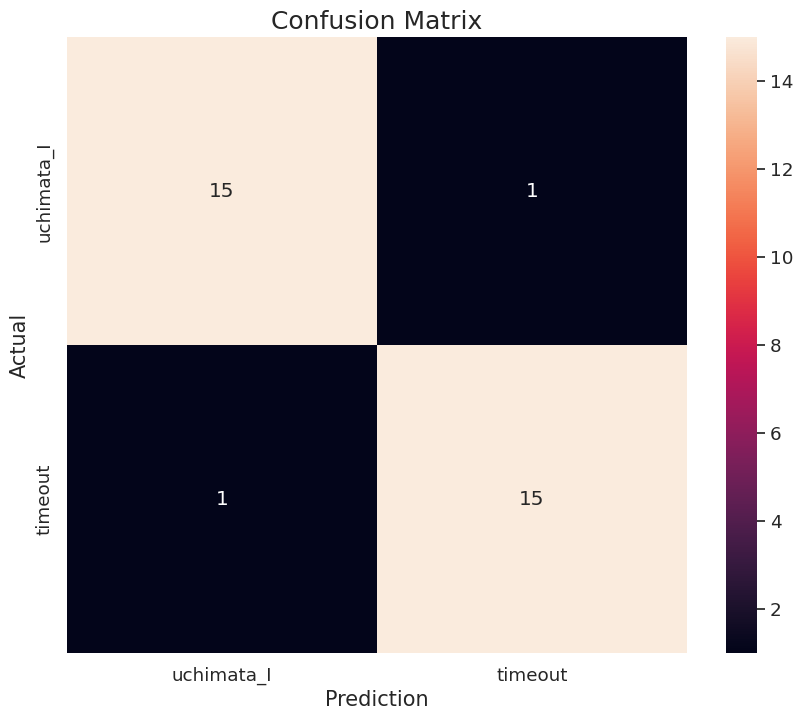
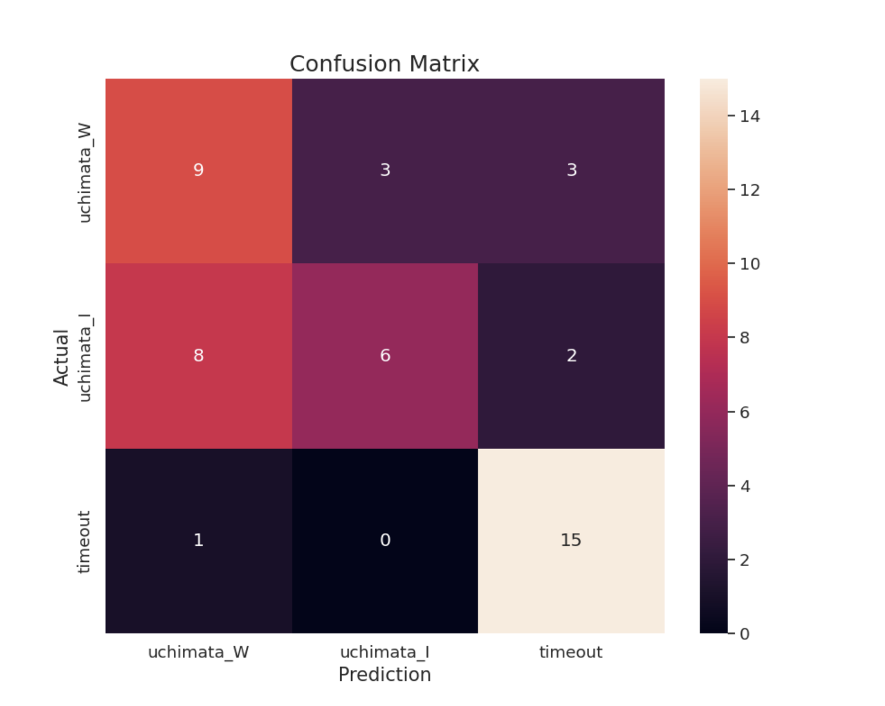
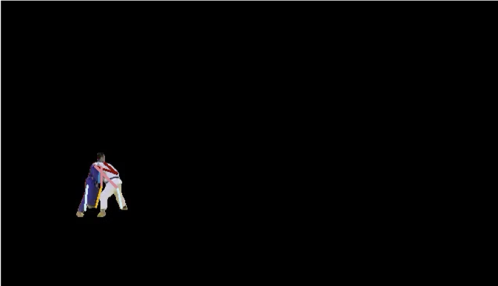
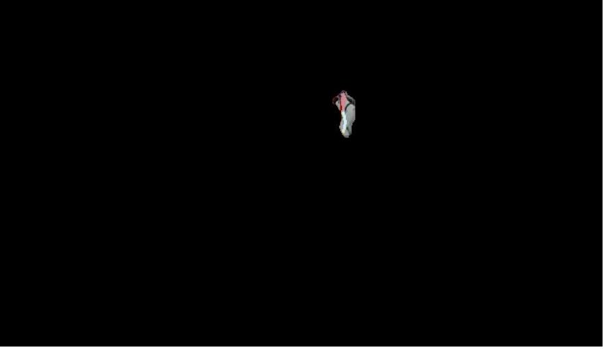

# 行動認識モデルを用いた柔道試合動画からの一本判定

**2023年度スポーツデータサイエンスコンペティション（柔道部門）** にて発表・入賞しました。  （詳細は `docs/スポコン_Judo_2023.pdf` および `docs/SDSC2023[口頭・入賞]柔道.pdf` を参照）

---

## ○ 概要

本研究では、柔道試合映像の「判定直前3秒間」から、
**「一本」**・**「技あり」**・**「時間切れ」** を行動認識モデルを用いて分類する手法を開発しました。

審判を映像から除去し、選手の動作のみを解析することで、
俯瞰視点（映像）で審判を補助する「VAR（Video Assistant Referee）」システムの実現を目指しました。

コンペには4人チームで参加し、主に私はLinuxサーバー上での環境構築や、学習済みモデルの選定・実装・評価を担当しました。

| 項目    | 内容                             |
| ----- | ------------------------------ |
| 対象競技  | 柔道（内股の一本判定）                    |
| 使用データ | 世界大会2018–2021年試合映像（計144本）      |
| 入力映像  | 試合終了直前の3秒間（約73フレーム）            |
| 主な使用モデル | DeepLabCut + MMAction2（ST-GCN） |
| 評価結果（2クラス）  | 一本 vs 時間切れ分類 精度 **93.75%**     |
| 評価結果（3クラス）  | 一本 vs 技あり vs 時間切れ分類 精度 **63.80%%**     |
| 発表    | スポーツデータサイエンスコンペティション2023 柔道部門  |

---

## ○ 背景・目的

柔道における「一本」判定は、以下のような定性的な基準に基づいて行われます。

| 一本の4条件        | 内容           |
| ------------- | ------------ |
| ① 相手を制していること  | 攻撃側が明確に優位である |
| ② 背が畳に付いていること | 背部の接地を確認     |
| ③ 強さがあること     | 投げの勢い・パワー    |
| ④ 速さがあること     | 投げのスピード・瞬発性  |

しかし、これらは熟練審判の感覚に依存しており、誤審の原因にもなっています。
 **AIによる映像解析で、定量的に「一本」を補助判定できる仕組み**を提案しました。

---

## ○ 提案手法の全体像

| ステップ      | 処理内容                                | 使用技術                        |
| --------- | ----------------------------------- | --------------------------- |
| ① 審判検出・除去 | LangSAMで審判を検出、XMemで追跡、ProPainterで削除 | LangSAM / XMem / ProPainter |
| ② 選手領域抽出  | 「青・白の道着を着た人物」をテキスト指定で抽出             | LangSAM                     |
| ③ 姿勢推定    | DeepLabCutによる骨格座標の推定                 | DeepLabCut                  |
| ④ 骨格系列作成  | PySKLでMMAction2互換フォーマット化・可視化・目視評価            | PySKL                       |
| ⑤ 行動認識    | MMAction2（ST-GCN）で学習・判定          | MMAction2                   |
| ⑥ 評価      | Confusion Matrixによる精度・再現率評価（2 or 3クラス）         | scikit-learn                |

---

### ■ 処理フロー概要

| 元映像                                  | 審判除去                                  | 姿勢推定                               | 行動認識                                    |
| ------------------------------------ | ------------------------------------- | ---------------------------------- | --------------------------------------- |
|  |  |  |  |

*Fig.1: 試合映像から一本判定までの一連のAI処理フロー*

---

## ○ システム構成

### **環境構築図**

| 処理段階  | 使用環境                      | 備考                  |
| ----- | ------------------------- | ------------------- |
| データ整形 | Google Colab / Python 3.9 | OpenCV + MoviePy    |
| モデル学習 | Linux GPUサーバ（NVIDIA RTX 4080）   | PyTorch + MMAction2 |
| 姿勢推定  | DeepLabCut (Colab用)       | Colab GPU利用         |
| 骨格可視化 | PySKL + matplotlib        | 結果確認・検証用            |

*Fig.2: 開発・学習・評価までのワークフロー*

---

## ○ 分析フロー（詳細）

| 手順 | 処理内容 | 使用モデル・手法 |
|-----------|-----------|----------------|
| データ準備 | 試合映像の抽出・整形 | OpenCV, MoviePy |
| 1.審判領域追従 | 審判の領域特定・自動セグメント | LangSAM + XMem |
| 2.審判除去 | 審判の映り込み除去 | ProPainter |
| 3.選手着目 | 選手以外の映り込み除去 | LangSAM（2人検出） |
| 4.1.姿勢推定 | 骨格座標の推定 | DeepLabCut（トップダウン型モデル） |
| 4.2.骨格データ化 | 骨格座標（Skeletonベース）作成・可視化・目視評価 | Pyskl（MMAction互換形式） |
| 5.行動認識 | 行動認識モデル学習 | MMAction2 (ST-GCN) |
| 評価 | 行動認識モデルの学習・テスト評価 | Confusion Matrixで性能確認 （2 or 3クラス） |

---

## ○ 結果

| 判定分類                    | 正答率        | 備考       |
| ----------------------- | ---------- | -------- |
| 一本 vs 時間切れ（2クラス）        | **93.75%** | 高精度で分類成功 |
| 一本 vs 技あり vs 時間切れ（3クラス） | **63.8%**  | 一本・技ありの境界が課題  |

### **混同行列**

| 2クラス分類                                          | 3クラス分類                                              |
| ----------------------------------------------- | --------------------------------------------------- |
|  |  |

*Fig.3: 一本/時間切れ・技あり分類の比較結果*

> 一本・時間切れの2分類ではほぼ誤判定なし。
> 技ありを含む3クラス分類では「一本・技あり」間で混同が発生。

---

## ○ 考察

1. **成功例（高精度分類）**

   * 両選手が明瞭に映り、姿勢推定結果が安定。

2. **失敗例（誤分類）**

   * カメラ角度が低く、背中の接地が判定しづらい。
   * 学習データを増やしたり、カメラを二つ用意したり、対処できるか検討

| 当てられた一本                         | 当てられなかった一本                    |
| ------------------------------- | ----------------------------- |
|  |  |

*Fig.4: 判定の成否例（カメラ角度・明瞭度の影響）*

---

## ○ 今後の展望

| 課題           | 改善方針                           |
| ------------ | ------------------------------ |
| 3クラス分類の精度改善 | 複数のカメラ視点を学習、追加学習のデータ量を増やす               |
| 姿勢推定の精度向上    | 選手の重なりによる見え隠れを改善する、学習データを増やす　　　　　　|

---

## ○ 実行環境

| 項目     | バージョン / 内容                |
| ------ | ------------------------- |
| OS     | Linux / Google Colab      |
| Python | 3.9                       |
| 深層学習環境 | PyTorch 1.8+   |
| 骨格可視化  | PySKL, Matplotlib         |
| 前処理   | OpenCV, MoviePy           |
| 機械学習による前処理  | LangSAM, XMem, ProPainter |
| 姿勢推定   | DeepLabCut                |
| 行動認識   | MMAction2           |

> ※ 学習データはスポーツデータサイエンスコンペティション提供のため非公開。

---

## ○ 引用・参考文献

* 陸 煒・盛 拓矢・北島 栄司・宮田 龍太（2023）
  「行動認識モデルを用いた柔道試合動画からの一本判定」
  *スポーツデータサイエンスコンペティション2023（柔道部門）*

* Lang-Segment-Anything: [https://github.com/luca-medeiros/lang-segment-anything](https://github.com/luca-medeiros/lang-segment-anything)

* XMem: [https://github.com/hkchengrex/XMem](https://github.com/hkchengrex/XMem)

* ProPainter: [https://github.com/sczhou/ProPainter](https://github.com/sczhou/ProPainter)

* DeepLabCut: [https://github.com/DeepLabCut/maDLC_NatureMethods2022](https://github.com/DeepLabCut/maDLC_NatureMethods2022)

* MMAction2: [https://github.com/open-mmlab/mmaction2](https://github.com/open-mmlab/mmaction2)

> 詳細な分析手法・発表スライドは `/docs/スポコン_Judo_2023.pdf` および `/docs/SDSC2023[口頭・入賞]柔道.pdf` を参照。

---

## ○ 発表実績

* **スポーツデータサイエンスコンペティション2023（柔道部門 入賞）**
* **口頭発表日:** 2024年1月6日（オンライン審査）
* **発表資料:**

  * `docs/スポコン_Judo_2023.pdf`
  * `docs/SDSC2023[口頭・入賞]柔道.pdf`
