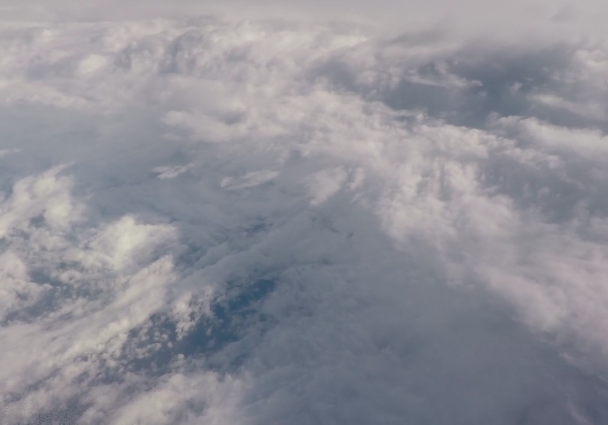
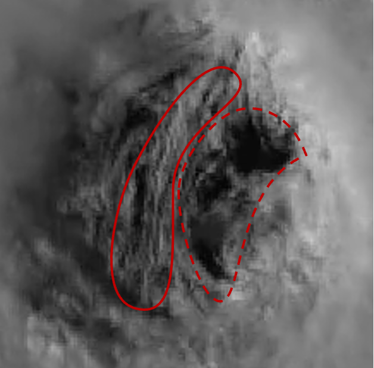
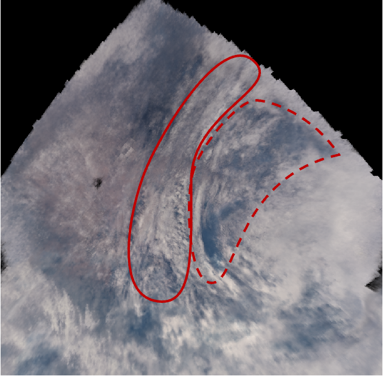
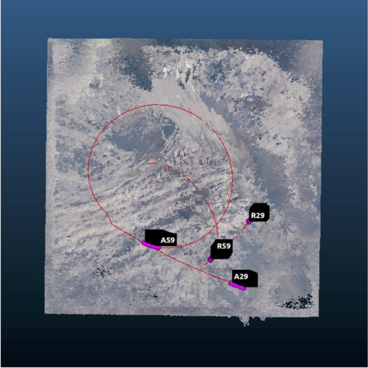
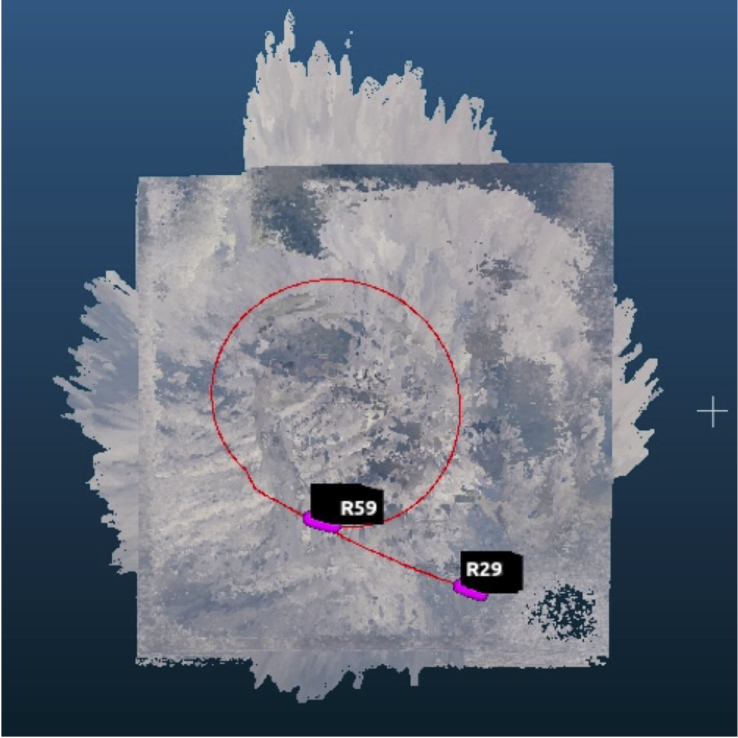

# 神経放射輝度場を用いた台風航空機観測映像からの壁雲3Dモデリングおよび高度測量

本研究は、琉球大学大学院 理工学研究科 知能機械システムプログラムにおける修士論文研究として2024年3月に発表されました。

- **Instant-NGPでVR化した台風**


---

## ○ 概要

本研究は、琉球大学理学部の山田広幸教授らが台風の中心付近に無線機つき測定器（ドロップゾンデ）を投下する航空機観測を実施しており、2021年9月29日に実施した **台風16号（Mindulle）** の航空機観測において、台風の目の中に突入して撮影された映像に対し、三次元構造を再現可能な深層学習モデル（神経放射輝度場: NeRF）を適用し、台風内部の壁雲を高密度点群として再構成して雲頂高度を定量的に測定したものです。

NeRFの高速モデルである Instant Neural Graphics Primitives (Instant-NGP) を用いて再構成された点群から、衛星観測データ（JAXAひまわり）と比較し、平均誤差200m以内の高精度な結果を得ました。

Pythonコードを、実装に基づいて整理・公開しています。

| 項目    | 内容                                                     |
| ----- | ------------------------------------------------------ |
| 使用データ | 2021年 台風16号（Mindulle）航空機観測映像                           |
| 撮影装置  | ダイヤモンドエアサービス社 ガルフストリームVI（右窓搭載カメラ）                      |
| 観測高度  | 約14.5 km                                               |
| 使用AI  | Instant-NGP（NeRF高速実装）                                  |
| 主な成果  | 雲頂高度 16,238 m（衛星との差 ±200 m）<br>段層雲高度 6,448 m（融解層高度と一致） |


工夫した点としましては、
航空機観測映像に紐づくカメラのGPS情報と画像から推定されたカメラ座標を用いて、実際の地理座標系での位置合わせを行ったことです。

まずInstant-NGP出力の点群と推定されたカメラ座標の座標系を合わせて統合し、CloudCompareという点群処理ソフトを用いて、GUI上で目視で対応するGPS座標とカメラ座標の位置合わせを行うことで、台風の点群データをメートル単位の実スケールのデータに変換し、衛星観測データ（雲頂高度）と比較可能にしました。

また航空機観測映像には、部分的に靄（もや）やハレーションの含まれるシーンがあったため、コントラスト調整とメディアンフィルタによるノイズ除去を行い、カメラ座標の推定精度を向上させるための工夫を行った。

**補足:**

> **航空機映像データは自体は含めません。**

---

## ○ 背景・目的

* 台風の勢力評価は、衛星画像による専門家の目視による勢力推定（ドボラック法）に依存しており、雲頂高さや内部構造の定量観測が困難です。
* 本研究では、航空機観測で得た**台風の目内部の観測映像**を、NeRFにより立体的に再構成し、**気象衛星の推定結果を補完できる新たな解析手法**を提案しました。
* 目標は、「雲頂高度を写真測量的に求め、衛星観測値（雲頂高度）と比較して有効性を確認」することです。

---

## ○ 分析フロー

| 手順         | 処理内容                           | 使用モデル・手法           |
| ---------- | ------------------------------ | ------------------ |
| データ準備      | 航空機観測映像の抽出・整形                  | OpenCV, EXIF解析     |
| 1. 画像前処理   | 歪み補正・輝度調整・リサイズ                 | OpenCV, NumPy      |
| 2. カメラ座標推定 | COLMAPによるStructure from Motion | COLMAP             |
| 3. NeRF変換  | COLMAP結果をInstant-NGP形式へ変換      | `colmap2nerf2.py`  |
| 4. NeRF学習  | Instant-NGPで3D再構成              | NVIDIA Instant-NGP |
| 5. 点群生成    | NeRF出力からPLY点群作成                | Open3D             |
| 6. 測量解析    | CloudCompareで雲頂高度計測・誤差解析       | CloudCompare       |
| 評価         | 雲頂高度と衛星データ比較                   | JAXAひまわり・ドロップゾンデ観測 |

---

## ○ 成果

1. **Instant-NGPによる台風内部の再構成**

| 航空機観測映像                                            | Instant NGPによる再現                                            |
| ------------------------------------------------------ | ----------------------------------------------------------- |
|  |  |

Fig.1 Instant-NGPが再構成した台風の壁雲構造（雲の層や筋状構造を忠実に再現）

---

2. **衛星画像との比較（真上視点）**

| 可視衛星画像                                            | Instant NGPによるVR再現（真上）                                            |
| ------------------------------------------------------ | ----------------------------------------------------------- |
|  |  |

Fig.2 NeRFによる真上視点画像とJAXA衛星画像の比較。目の筋状雲や黒い窪みが確認できる。

---

3. CloudCompareによる点群の位置合わせ

| 位置合わせ前                                            | 位置合わせ後                                            |
| ------------------------------------------------------ | ----------------------------------------------------------- |
|  |  |

Fig.3 COLMAP点群とNeRF点群のカメラ座標で位置合わせ

---

4. Mindulle (2021) の壁雲の雲頂高度を測量

| 点群測量箇所                                            | 点群測量結果                                            |
| ------------------------------------------------------ | ----------------------------------------------------------- |
|  |  |

Fig.4 ピンク色の点を赤い矢印の向きに10点選択して雲頂を測量した平均結果.
2
度は 16,238 m となった

## ○ 結果

| 測定対象                 | 平均高度誤差       | 備考                     |
| -------------------- | ------------ | ---------------------- |
| 雲頂高度（Instant-NGP再構成） | **±100 m以内** | JAXAひまわり雲頂高度との比較で高精度一致 |
| 雄大雲（積乱雲上層構造）         | **融解層高度と同等** | ドロップゾンデ観測値（RH=100%）と一致 |

> NeRF再構成により、航空機視点から撮影された複数枚の画像のみで、
> 台風内部の立体構造を定量的に再現可能であることを示しました。

---

## ○ 実行環境（参考メモ）

* OS: Ubuntu / Linuxサーバー環境
* Python: 3.9
* GPU: NVIDIA RTX A5000
* 主要ライブラリ

  * 画像処理: `opencv-python`, `numpy`, `matplotlib`
  * 3D再構成: `COLMAP(SfM)`, `Instant-NGP`
  * 点群解析: `Open3D`, `CloudCompare`
  * データ整形: `json`, `pandas`
* JSON構成ファイル:

  * `base_cam.json` … 基本カメラパラメータ
  * `transforms.json` … COLMAP出力をNeRF形式へ変換したデータ

> ※ 本リポジトリは**観測映像非公開・再現実行不可**です。環境構成・手順は**参考資料**として掲載しています。

---

## ○ 今後の改善点

* [ ] **再構成精度の向上**：カメラパラメータ最適化とノイズ除去
* [ ] **自動位置合わせアルゴリズムの導入**：GPSデータとカメラ座標の自動整合
* [ ] **汎化モデルの構築**：他台風事例への適用・統合解析（今回は1事例のみ）
* [ ] **リアルタイム推論**：GPU最適化による学習時間短縮

---

## ○ 引用・参考文献

* 盛 拓矢・北島 栄司・山田 広幸・伊藤 耕介・宮田 龍太（2024）
  「神経放射輝度場を用いた台風航空機観測映像からの壁雲3Dモデリングおよび高度測量」
  琉球大学大学院 理工学研究科 修士論文
* Müller, T. et al. (2022). *Instant Neural Graphics Primitives with a Multiresolution Hash Encoding.*
* JAXA ひまわりデータアーカイブ
* CloudCompare: [https://www.cloudcompare.org/](https://www.cloudcompare.org/)
* COLMAP: [https://colmap.github.io/](https://colmap.github.io/)

> ※ 研究背景・手法・結果の詳細は `docs/修士論文_盛拓矢.pdf` を参照してください。

---

## ○ フォルダ構成（提案）

```
typhoon_nerf_project/
├── preprocessing/
│   ├── 2点1と2点3の前処理.ipynb
│   └── 2点2の画像の前処理と2点3のカメラ座標推定.ipynb
├── modeling/
│   ├── 2点4のInstantNGPの学習.ipynb
│   ├── 2点5の点群作成.ipynb
│   └── 2点6のCloudCompareを用いた点群測量.ipynb
├── scripts/
│   ├── colmap2nerf2.py
│   └── run2.py
├── data/
│   ├── base_cam.json
│   └── transforms.json
├── docs/
│   └── 修士論文_盛拓矢.pdf
└── README.md
```
