# 神経放射輝度場を用いた台風航空機観測映像からの壁雲3Dモデリングおよび高度測量

琉球大学大学院 理工学研究科 知能機械システムプログラムにおける修士論文研究として2024年3月に発表されました。

- **Instant-NGPでVR化した台風**

---

## ○ 概要

本研究は、琉球大学理学部の山田広幸教授らが実施した航空機観測（2021年9月29日・台風16号Mindulle）において、台風の目の中に突入して撮影された映像に対し、三次元構造を再現可能な **神経放射輝度場（NeRF）** を適用したものです。

深層学習モデル **Instant Neural Graphics Primitives (Instant-NGP)** により、台風内部の壁雲を高密度点群として再構成し、雲頂高度を定量的に測定しました。

Pythonコードを、実装に基づいて整理・公開しています。

| 項目 | 内容 |
|------|------|
| 使用データ | 2021年 台風16号（Mindulle）航空機観測映像 |
| 撮影装置 | ダイヤモンドエアサービス社 ガルフストリームVI（右窓搭載カメラ） |
| 観測高度 | 約14.5 km |
| 使用AI | Instant-NGP（NeRF高速実装） |
| 主な成果 | 雲頂高度 16,238 m（衛星との差 ±200 m） 段層雲高度 6,448 m（融解層高度と一致） |

**工夫点：**
- 航空機観測映像に紐づくGPS情報とCOLMAPで推定したカメラ座標を統合し、実スケールで位置合わせ。  
- CloudCompare上で点群をメートル単位に変換し、衛星観測データおよび航空機観測データとの比較を実現。
- CLAHEによる特徴点増加とメディアンフィルタによるノイズ抑制を組み合わせ、SfMにおける安定した疎点群生成を目指した。

**補足:**
> 本リポジトリには航空機映像データ自体は含まれません。

---

## ○ 背景・目的

* 台風の勢力評価は、衛星画像の専門家の目視による勢力推定（ドボラック法）に依存しており、雲頂高度・内部構造の定量観測が困難。
* 航空機観測映像をAIで立体再構成することで、**気象衛星の推定結果を補完できる新たな解析手法**を提案。
* 「写真測量的に雲頂高度を求め、衛星推定値との一致度を検証」すること等を目標とした。

---

## ○ 分析フロー

| 手順 | 処理内容 | 使用技術 |
|------|-----------|----------|
| データ準備 | 航空機観測映像の抽出・整形 | OpenCV, EXIF解析 |
| 1. 画像前処理 | 歪み補正・輝度調整・リサイズ | OpenCV, NumPy |
| 2. カメラ座標推定 | Structure-from-Motionによる推定 | COLMAP |
| 3. NeRF変換 | COLMAP出力をInstant-NGP形式に変換 | `colmap2nerf2.py` |
| 4. NeRF学習 | Instant-NGPによる3D再構成 | NVIDIA Instant-NGP |
| 5. 点群生成 | NeRF出力からPLY点群作成 | Open3D |
| 6. 測量解析 | CloudCompareで雲頂高度計測 | CloudCompare |
| 評価 | 雲頂高度と衛星データ比較 | JAXAひまわり・ドロップゾンデ観測 |

---

## ○ 成果

1. **Instant-NGPによる台風内部の再構成**

| 航空機観測映像 | Instant-NGPによる再構成 |
|----------------|------------------------|
| 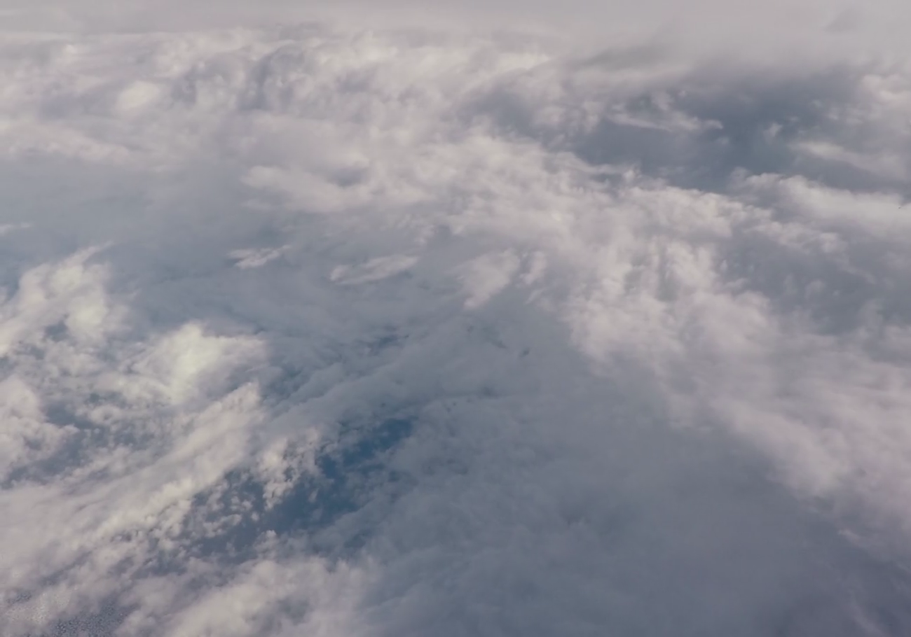 |  |

*Fig.1 Instant-NGPが再構成した台風の壁雲構造（雲の層や筋状構造を忠実に再現）*

---

2. **衛星画像との比較（真上視点）**

| 可視衛星画像 | Instant-NGPによる真上視点 |
|---------------|-----------------------------|
| 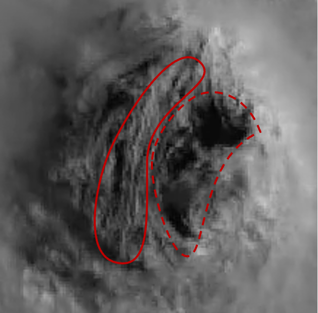 | 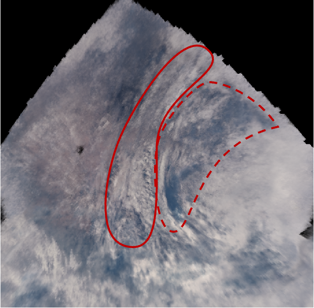 |

*Fig.2 NeRFによる真上視点画像とJAXA衛星画像の比較。目の筋状雲や黒い窪みが一致*

---

3. CloudCompareによる点群の位置合わせ

| 位置合わせ前 | 位置合わせ後 |
|----------------|----------------|
| 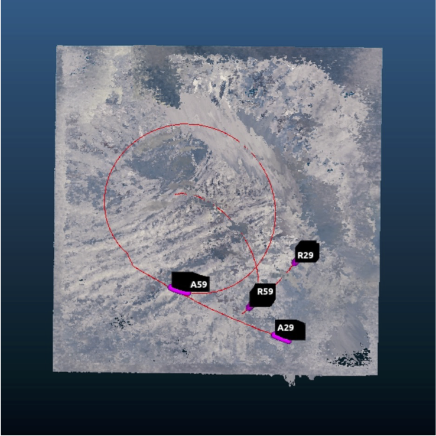 | 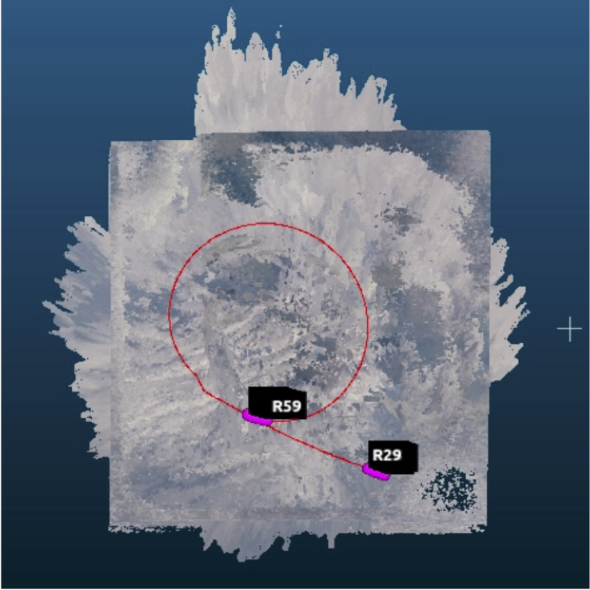 |

*Fig.3 COLMAP点群とInstant-NGP点群のカメラ座標で位置合わせ*

---

4. Mindulle (2021) の壁雲の雲頂高度を測量

| 測量箇所 | 測量結果 |
|-----------|-----------|
| 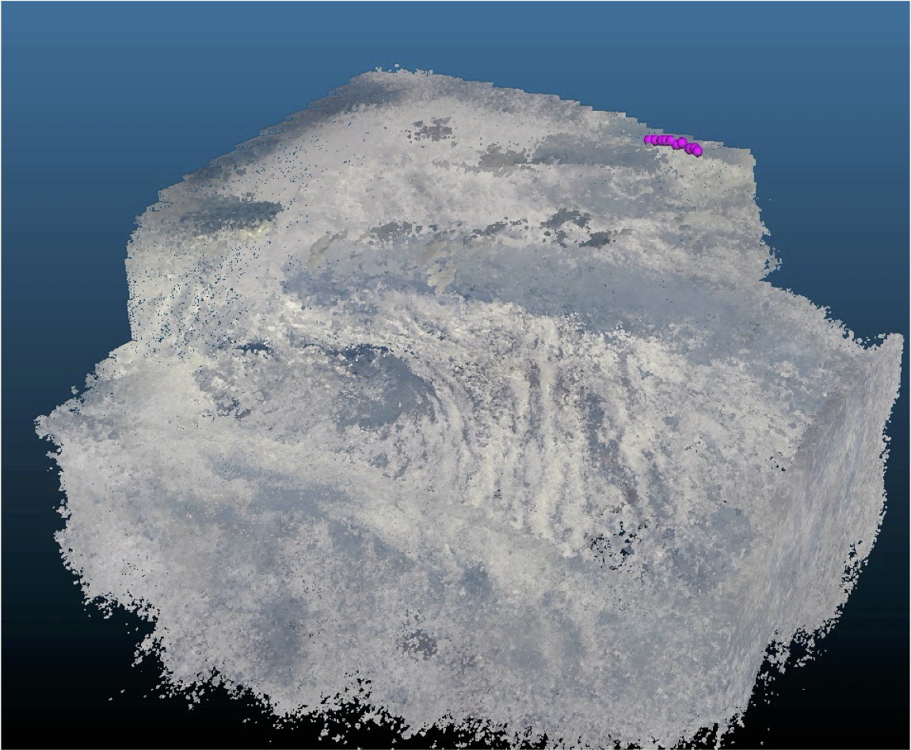 | 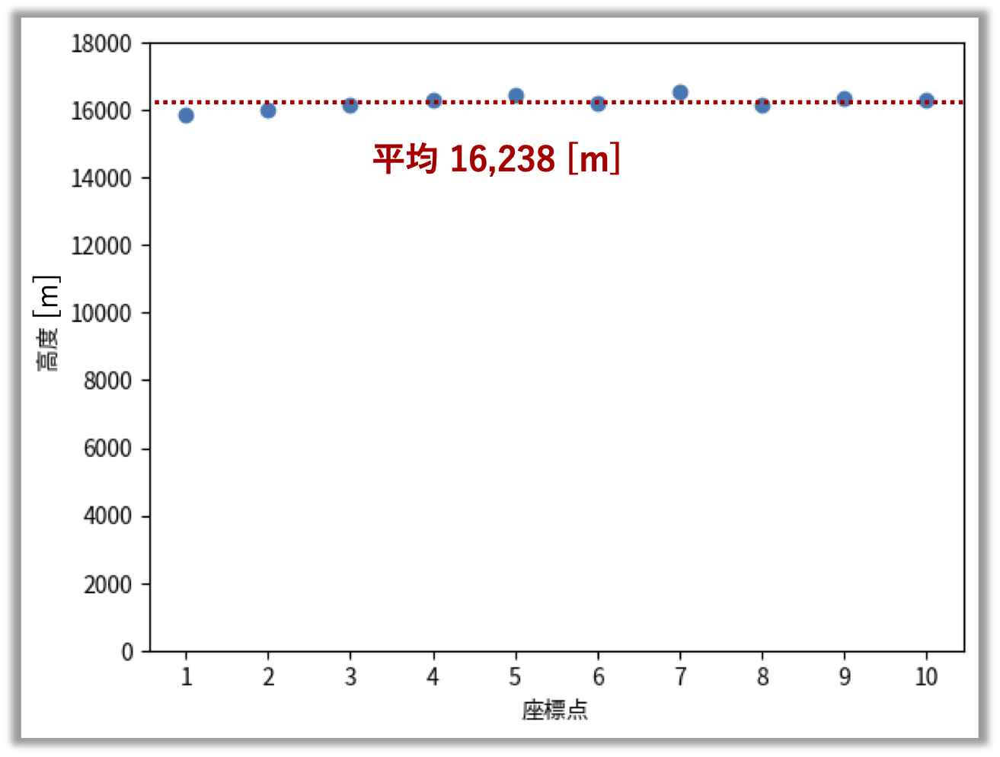 |

*Fig.4 ピンク色の点を赤い矢印の向きに10点選択し、雲頂を測量した平均結果*

---

5. Mindulle (2021) の壁雲の雲頂高度を測量

| JAXA雲頂高度 | Instant-NGP点群雲頂高度 |
|----------------|---------------------------|
| 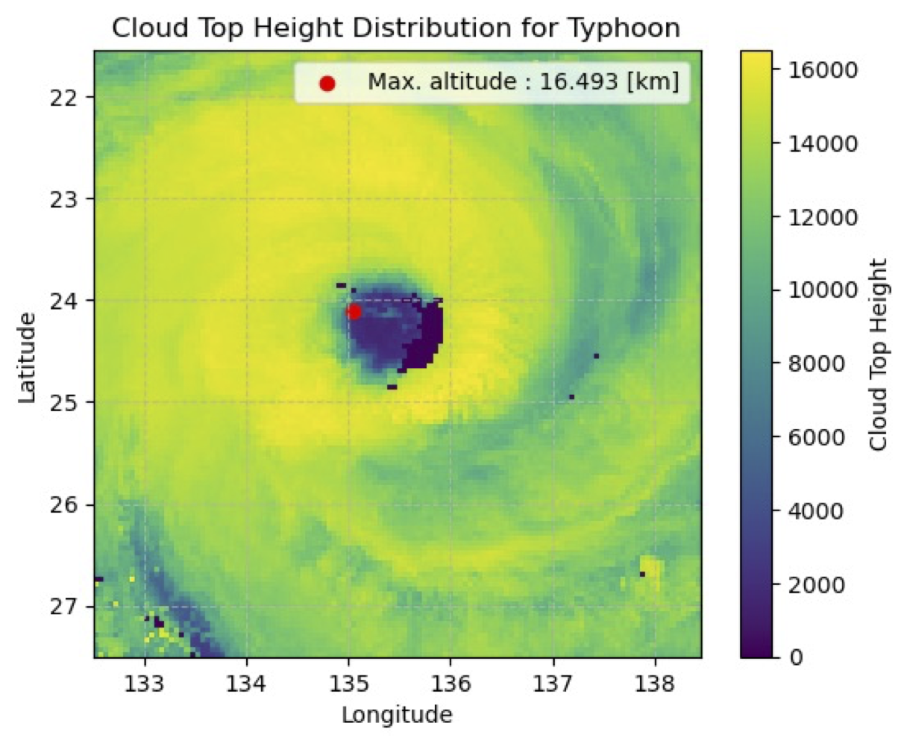 |  |

*Fig.5 JAXA衛星観測とInstant-NGP点群の雲頂高度を比較*

| データ | 平均雲頂高度 | 誤差 |
|--------|---------------|------|
| Instant-NGP点群 | 16,238 m | — |
| JAXAひまわり | 16,493 m | 約200 m |

---

6. 段層状の壁雲（Congestus層）の高度測量

| 測量箇所 | 測量結果 |
|-----------|-----------|
| 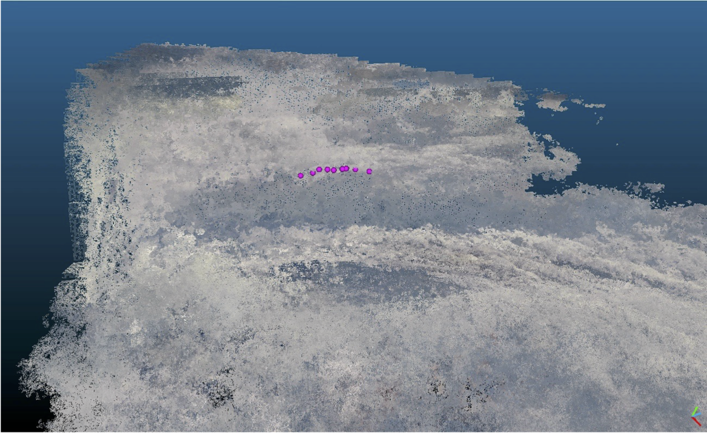 | 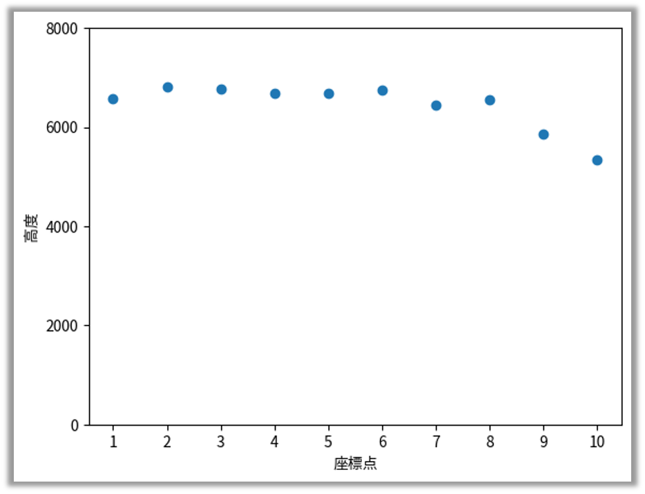 |

*Fig.6 段層構造雲の高度を測量*

---

7. ドロップゾンデの観測値との高度比較

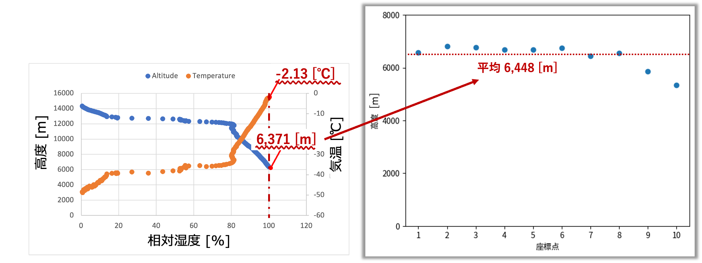

Fig.7 融解層（RH=100%、気温0℃）付近でCongestus層と一致。写真測量による温度層推定の可能性を示唆。

## ○ 結果

| 測定対象  | 平均高度誤差 | 備考 |
| -------------------- | ------------ | ---------------------- |
| 雲頂高度（Instant-NGP再構成） | **約200 m** | JAXAひまわり雲頂高度との比較で高精度一致 |
| 雄大雲（積乱雲上層構造）         | **融解層高度と同等** | ドロップゾンデ観測値（RH=100%）と一致 |

- Instant-NGPにより、航空機観測映像から台風をVR再現
- 点群測量結果はJAXAひまわり雲頂高度とほぼ一致（誤差 ≈ 200 m）
- 段層構造雲の測定結果から、融解層高度（0℃）を写真測量で推定可能であることを示唆
- 従来の衛星観測では取得困難な目内部の立体構造解析を実証
---

## ○ 実行環境

- OS: Ubuntu 20.04 / Linuxサーバー  
- Python: 3.9  
- GPU: NVIDIA RTX 4080  
- 主なライブラリ  
  - 画像処理: `OpenCV`, `NumPy`  
  - 3D再構成: `COLMAP (SfM)`, `Instant-NGP`  
  - 点群解析: `Open3D`, `CloudCompare`  
  - データ整形: `pandas`, `json` 

> ※ 本リポジトリには観測映像は含まれません。手法・構成を参考目的で公開しています。

---

## ○ 今後の改善点

* [ ] **再構成精度の向上**：360度画像，より精密なGPS情報，画像の深度情報の追加
* [ ] **雲の動きを考慮したモデルで検証** : 動的NeRF（Dynamic NeRF）への拡張
* [ ] **自動位置合わせアルゴリズムの導入**：GPSデータとカメラ座標の自動整合（CloudComPyを使う）
* [ ] **様々な台風で実証**：他台風事例への適用・統合解析（今回は1事例のみ）
* [ ] **台風点群データの解析** : 点群からの温度推定モデル開発(台風の内部気温と強度には関係あり)

---

## ○ 引用・参考文献

- 盛 拓矢・北島 栄司・山田 広幸・伊藤 耕介・宮田 龍太（2024）  
  「神経放射輝度場を用いた台風航空機観測映像からの壁雲3Dモデリングおよび高度測量」  
  琉球大学大学院 理工学研究科 修士論文  
- Müller, T. et al. (2022). *Instant Neural Graphics Primitives with a Multiresolution Hash Encoding.*  
- JAXA ひまわりデータアーカイブ  
- CloudCompare: [https://www.cloudcompare.org/](https://www.cloudcompare.org/)  
- COLMAP: [https://colmap.github.io/](https://colmap.github.io/)  

> ※ 研究背景・手法・結果の詳細は `docs/修士論文_盛拓矢.pdf` を参照してください。
